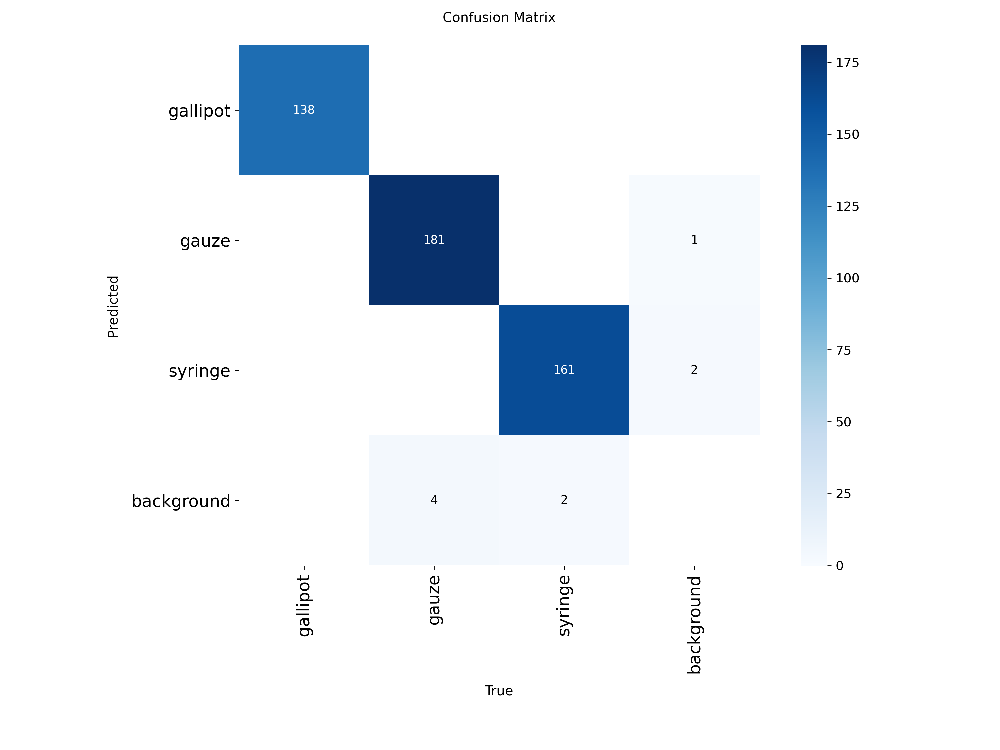
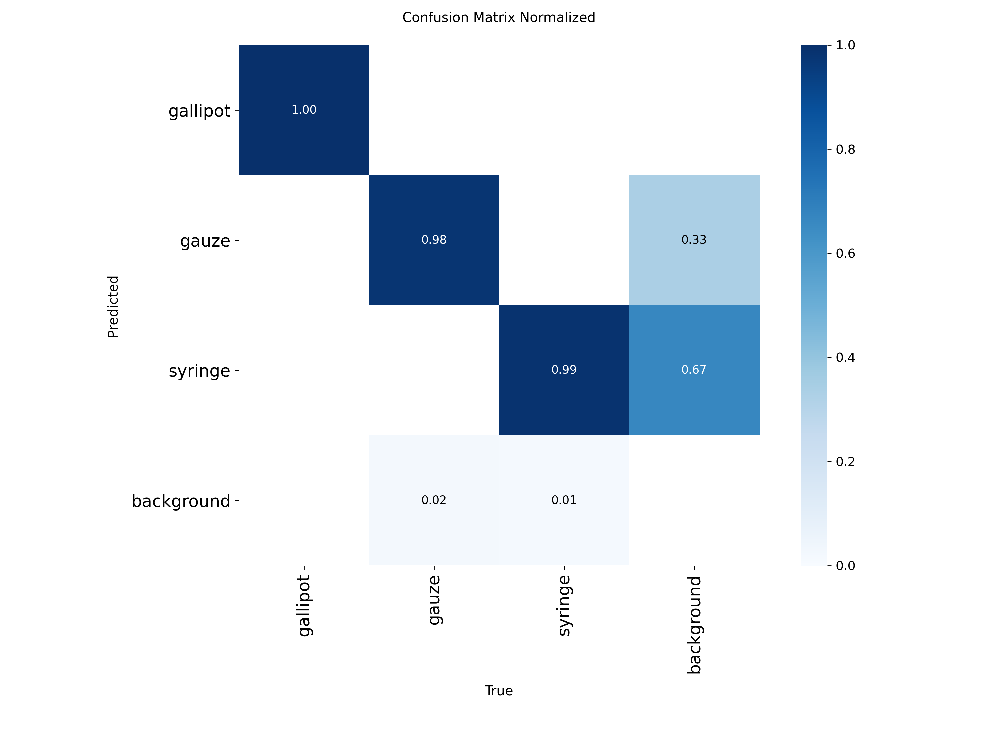
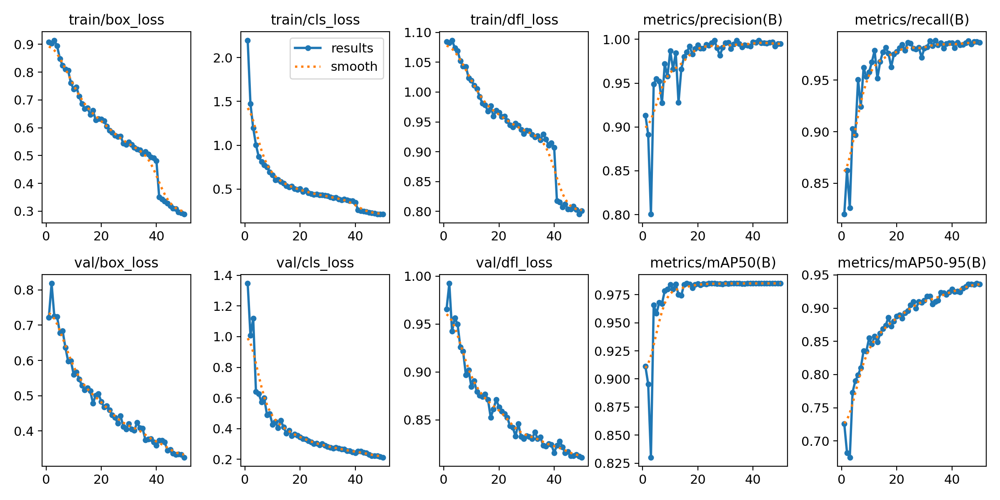
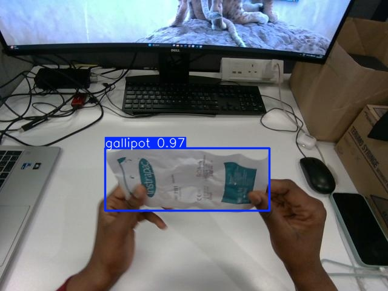

# 🧼 Sterile Objects Detection using YOLOv8

## 📌 Project Overview

This project implements a real-time object detection system for identifying sterile medical instruments using **YOLOv8 (Ultralytics)**.

The model detects three key classes:

- 🧴 Gallipot  
- 🧻 Gauze  
- 💉 Syringe  

The goal is to support automated monitoring in clinical environments to improve safety and efficiency.

---

## 🚀 Model Performance

| Metric | Value |
|--------|------|
| Precision | ~0.995 |
| Recall | ~0.987 |
| mAP@0.5 | ~0.985 |
| mAP@0.5:0.95 | ~0.93–0.94 |

---

## 📊 Per-Class Performance

| Class | Precision | Recall | mAP@0.5 | mAP@0.5:0.95 |
|------|----------|--------|----------|--------------|
| Gallipot | ~0.999 | ~1.00 | ~0.995 | ~0.95 |
| Gauze | ~0.998 | ~0.97 | ~0.965 | ~0.89 |
| Syringe | ~0.988 | ~0.98 | ~0.985 | ~0.94 |

---

## 🧠 Model Architecture

- Model: YOLOv8 (Ultralytics)
- Backbone: CSP-based CNN
- Input Size: 640 × 640
- Framework: PyTorch
- Device: NVIDIA CUDA GPU

---

## 📂 Dataset

- Format: YOLO annotation format
- Classes:
  - Gallipot
  - Gauze
  - Syringe

### Splits:
- Train
- Validation
- Test

---

## 📈 Results

### 🔷 Confusion Matrix





---

### 📊 Training Curves



---
## 🔍 Sample Predictions

Here are example outputs from the trained model:




---

## ⚙️ Installation

```bash
git clone https://github.com/MawueugiioEnya/sterile-objects-detector.git
cd sterile-objects-detector
pip install -r requirements.txt
```
---

## 🧪 Inference
``` bash
yolo detect predict model=weights/best.pt source=images/sample_predictions save=True
```
---
## 📦 Project Structure

```bash
sterile-objects-detector/
│
├── images/
│   ├── sample_predictions/
│   ├── confusion_matrix.png
│   ├── confusion_matrix_normalized.png
│   └── results.png
│
├── weights/
│   └── best.pt
│
├── notebooks/
│   └── training.ipynb
│
├── data.yaml
└── README.md
```
---
## 💡 Key Learnings

- YOLOv8 training pipeline
- Dataset annotation workflow
- Model evaluation (mAP, precision, recall)
- Real-world medical detection constraints


---


## 👤 Author
Eugenia Mawuenya Akpo
Computer Vision / Machine Learning/ Robotics Portfolio Project
